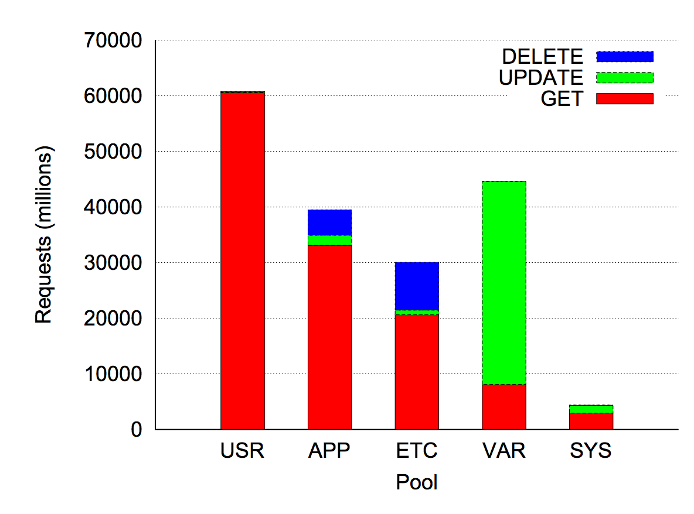
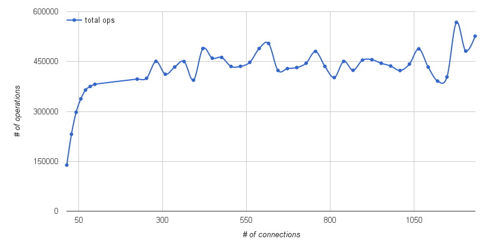

# Memcached

## Outline
Memcached is a simple distributed memory object cache [1]. It provides a simple interface to allow systems to store, retrieve and update the contents of the cache. It is developed as an open source project and has been extensively studied in the literature. Often, it is used as an application of choice to benchmark system configurations in terms of network throughput, memory allocation policies and more generally to understand how a system performs under stress. Furthermore, it is often used as an application for experiementation and implementation of next generation technology such as the use of a Field Programmable Gate Array (FPGA) [2].

The API supported by memcached is straightforward. Memcached philosophy is to execute commands against an item of the cache rather than manipulate the cache as a whole. Out of the box, memcached supports the following operations for retrieval: *set, add, replace, append, prepend and cas* [3]. Similarly, memcached supports the following storage commands: *get, gets, delete and incr/decr* [3]. The API is deliberetly designed to be intuitive making the effect of an action predictable. The action labelled *cas* perhaps requires further clarification, however. The full action name is *check and set*, data is stored only if the comparison with current value fails.

Memcached has grown to be a very popular general purpose cache in the industry. Currently, Facebook is considered to have the largest deployment of memcached in production [4] while there are many other companies utilizing large deployments of memcached as building blocks of their infrastructure, these include Twitter[5], Amazon [6] and many others. 

In the simplest memcached deployment, an instance of memcached can be run alongside another application, for example a web server. In such a setup, no network communication is required and the web server can talk to memcached over a local unix socket. This configuration has disadvantages, for example, horizontally scaling the web server would require another instance of the cache to be deployed as well potentially leading decreased cache hit rate.

More complicated deployments generally utilize a memcached instance running on a seperate host with all instances of, for example, web servers communicating with a single memcached host. The advantage of such a setup is decreased coupling and increased potential for scalability by adding more instances of both web server and memcached.

In the largest scenarios, such as Facebook, a large number of client applications are talking to a number of memcached clusters responsible for a given type of information. Effectively creating a data layer where any client application can request information from any pool increasing modularity and interoperability of the infrastructure. [Ref?] 

(Diagram to illustrate deployments here?)

To illustrate the importance and also the size of a memcached deployment, a workload charasterization from Facebook will be used [7]. Figure below illustrates the throughput observed in a Facebook pools deployed over the course of 7 days. We can observe that the total number of requests is close to 1.26 trillion requests over 7 days, this is on average 2.08 million requests a second. The volume itself is large, however, considering Facebook has 1.44 billion active monthly users [8], however, it does demonstrate the scale at which Facebook utilizes memcached and the impact memcached has on ability to scale and handle traffic at Facebook.

## Design decisions
From the early development stages, memcached has been designed in a client-server architecture. Therefore, a memcached applications receives a command based on its API, executes the command and returns a reply to the client. Memcached is deliberetly designed as a standalone application rather than being integrated into a particular system/framework in order to be able to act as a general purpose cache and allow decoupling of responsibilities in an system architecture.

Memcached implements its distributed protocol through consistent hashing on the client side. Therefore, keeping logic on the server side minimal and allowing the clients to figure out which instance to talk to. In order to further improve horizontal scaling properties of memcached, solutions such as Twemproxy [9] exist to support scalability of an individual shard of a distributed memcached deployment.

The memory requirements of memcached are specified as a configration option before the memcached application is started. Knowing an upper bound on the amount of memory memcached can use allows memcached to claim the required memory and handle memory management itself rather than using *malloc, free or realloc*. *Slabs* are structured to be blocks of memory with 1MB allocated to them. Each slab belogns to a *slab group* which determines the size of each chunk inside the slab. By default, the minimum chunk size is 80 bytes with a hard maximum of 1MB. The growth factor between different slab groups is 1.25. Within each slab group, a Least Recently Used (LRU) eviction policy is employed effectively evicting entries least recently used within a similar memory requirement first.

Private networks are the intended target of memcached where applications designed to be publicly exposed access memcached on behalf of the requestor rather than exposing the cache directly. By default, memcached provides access to all entries of the cache for all clients but there is also an option to be used with a Simple Authentication and Security Layer (SASL) option.

Memcached is a multi-threaded application which introduces the requirement to lock resources during critical sections in order to prevent race conditions. The main reason for designing multi-threaded applications is improve performance. Parsing a request and understanding the nature of a request can be in parallel with data retrieval from memory while a response is being constructed, all in their own respective threads. However, in order to achieve the apprearance of operation atomicity, a mutual exclusion lock is required. A request lifecycle is as follows [10]:

1. Requests are received by the Network Interface Controller (NIC) and queued
2. *Libevent* receives the request and delivers it to the memcached application
3. A worker thread receives a request, parses it and determines the command required
4. The *key* in the request is used to calculate a hash value to access the memory location in *O(1)*
5. Cache lock is acquired *(entering critical section)*
6. Command is processed and LRU policy is enforced
7. Cache lock is released *(leaving critical section)*
8. Response is constructed and transmitted

Given the outline above, we can see that steps 5. to 7. transform the parallel nature of processing a request into a serial process. Optimizations to the critical section have been well studied but it should be noted that memcahed suffers from overheads related to global lock acquizition and release.

## Configuration options
Memcached provides a convenient command line configration options to tweak the performance of memcached through various parameters, the most important ones are:
* *-d* runs application in daemon mode
* *-p <port>* binds application to a port (18080 by default)
* *-m <memory>* defines how much memory to allocate to memcached.

Given the host hardware has 8GB memory, 6GB will be allocated to memcached to leave some memory for the underlying operating system. Throughout this paper, mostly options outlined above will be utilized. Where applicable, further settings will be explained.

## Throughput under QoS
Firstly, to establish a baseline it is essential to understand memcached behavior under high utilization. In order to establish this baseline, a default configuration of memcached will be used with a variable workload generated by the clients. Therefore, the memcached server is started with the following configuration `memcached -d -p 11120 -m 6144` setting the port and allocating 6GB of memory to memcached. Each memtier instance is configured with variable number of connections and treads such that the total number of connections (threads * number of connections per thread) is progressively increased. Memtier instances use the following configuration: `memtier -s nsl200 -p 11120 --test-time=60 -c <number of clients> -t <number of threads> -P memcache_binary --random-data --key-minimum=100 --key-maximum=10000`. The key size is capped between 100 and 10000 in order to simulate a realistic hit rate.

*Throughput vs mean and 99th perecentile latency*

From the figure above, we can see that both the mean latency and the 99th perecentile latency increases linearly until we reach a saturation point at which point each increase in throughput is met with a much larger increase in latency. Additionally, we can see that the highest throughput achieved with 99th percentile under 1ms is 375k operations per second. This corresponds to 84 simultaneous connections, or 12 connections per each client. This is similar to benchmarks used in the literature [11]. Twelve connections per client may seem low, however, memtier connection lifecycle only lasts for a single requests and the connections are dropped and re-created, effectively resulting in the order of 31000 connections per second per client.

In order to further understand the impact of an increase in the number of connections, consider the figure above comparing the number of connections with the number of operations executed. We can see that memcached scales well until we reach a saturation point at around 84 connections (highlighted). A further increase in the number of connections is met with a much lower increase in the total number of operations performed. The shaded segments under the curve represent the portion of CPU time spent processing memcached (blue) and in the system (red). Furthermore, we can see that when we reach the saturation point, memcached CPU usage remains consistent while all the remaining time is spent in the system. The system requires a large number of resources to process the incoming network requests and to process the outgoing requests from memcached. Finally, the diagram also demonstrates that memcached performance is tightly linked with the performance of the network stack and the underlying hardware responsible for handling incoming and outgoing communication. This is consistent with findings in other papers [12].

 

* [1] [memcached.org](http://memcached.org/)
* [2] An FPGA-based in-line accelerator for Memcached, Maysam Lavasani, Hari Angepat, and Derek Chiou
* [3] [New Commands, Memcached.org](https://code.google.com/p/memcached/wiki/NewCommands)
* [4] [Scaling memcached at Facebook](https://www.facebook.com/notes/facebook-engineering/scaling-memcached-at-facebook/39391378919/)
* [5] 
* [6] [Amazon ElastiCache](http://aws.amazon.com/elasticache/)
* [7] Workload Analysis of a Large-Scale Key-Value Store, Berk Atikoglu, Yuehai Xu, Eitan Frachtenberg, Song Jiang, Mike Paleczny
* [8] http://investor.fb.com/releasedetail.cfm?ReleaseID=908022
* [9] [Twemproxy](https://github.com/twitter/twemproxy)
* [10] [Enhancing the Scalability of Memcached](https://software.intel.com/sites/default/files/m/0/b/6/1/d/45675-memcached_05172012.pdf)
* [11] Thin Servers with Smart Pipes: Designing SoC Accelerators for Memcached - Kevin Lim, David Meisner, Ali G. Saidi, Parthasarathy Ranganathan, Thomas F. Wenisch
* [12] MICA: A Holistic Approach to Fast In-Memory Key-Value Storage