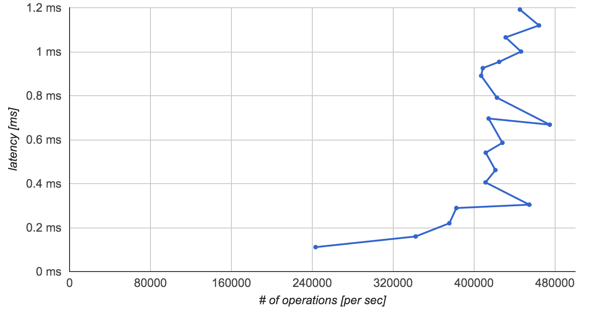

# Establishing memcached baseline

## Introduction
In order to be able to effectively study the performance of Memcached and Redis, it is essential to establish a baseline performance. Firstly the focus is on establishing level of throughput with mean latency of 1ms on a basic configuration of the cache. Secondly, scaling of memcached in terms of threads and processes is presented. Finally, the baseline performance is compared to previous research in the area.

## Methodology

### Hosts
Benchmarks are run on 8 machines with the following configuration: 6 core Intel(R) Xeon(R) CPU E5-2603 v3 @ 1.60GHz, 8 GB RAM and 1Gb/s NIC.

### Network
The network topology is a star with one host acting as cache server with the remaining seven machines acting as clients generating load on the cache server.

### Benchmark executiong
Benchmark execution is performed as a parallel SSH into the hosts in question and executing Memtier benchmark. Results are collected and aggregated.

## Single instance baseline
To establish a single cache instance baseline, benchmarks of increasing load in terms of the number of requests are used to determine the maximum throughput a single instance is able to cope with.

### Configuration
The memcached server is configured with the following parameters, other parameters are left in default settings:
* Memory usage: 6GB
* Number of threads: 4 (default)

The clients use the following configuration (rest in default configuration):
* Number of connections: *n*
* Number of threads per connection: 4
* Memcached binary protocol: true
* Generate random data
* Key range: 100 - 10000 (min - max)

where *n* is being varied from 1 to 40 with linear increments of 1.

## Latency vs Throughput

(Figure 1)

From the figure above, we can see that as we increase the load on the server, the mean latency increases steadily until we get close to 400 000 operations and start seeing a sharp increase in mean latency without significant improvement in throughput. This is the saturation point at which the cache latency stops scaling linearly with load.

The highest throughput occurs with mean latency of 0.668ms at 474936 operations per second. This corresponds to a configuration of 17 conncetions at 4 threads each per each load generating host. This gives a total of 476 simultaneous connections.

The mean throughput below 1ms is 404391 operations per second with a mean latency of 0.563ms.

Moving forward, we can use 16 connections with 4 threads each as a reasonable client configuration.

## Scaling memcached
Firstly, memcached is scaled in terms of threads in order to understand the impact of multi-threading on the system. Secondly, multiple memcached instances are studied.

### Scaling memcached with threads
Memcached provides a configuration flag to configure the number of threads memcached is using. In the previous study, we focused on increasing the load while in this section the load will be kept constant and the number of threads will be varied. By default, memcached runs with four threads and it is also the configuration used in the previous benchmark.

#### Configuration
The client configuration used is at follows:
* Number of connections: 16
* Number of threads per connection: 4
* Memcached binary protocol: true
* Generate random data
* Key range: 100 - 10000 (min - max)

Server configuration:
* Memory usage: 6GB
* Number of threads: *n*

Where n ranges between 1 and 100 in linear increments of size 1.

#### Results
In order to understand the impact of threads, we look at the throughput, latency of the responses on the client side and the CPU utilization on the server side.

(Figure 2)

(Figure 3)

(Figure 4)

From Figure 2, we can see that latency improves dramatically until we reach 6 threads and rises steadily with number of threads larger than 6. Similarly, the number of operations per second peaks at 6 threads and declines steadily after. Figure 4 shows that memcached cpu usage will increase steadily with the number threads until we reach 6 threads at which point the CPU usage remains steady.

#### Analysis
The results outlined above are consistent with a memcached recommendation to run memacached with the number of threads equal to the number of CPU cores. Indeed, our test server has only 6 cores and from the benchmarks it can be seen that the overhead of larger number of threads than cpu cores actually decreases performance. Furthermore, Figure 4 also illustrates that memcached is networking heavy, all of the CPU capacity beyond application requirements are spent in the network stack and interrupt handling.

### Scaling memcached instances
An alternative approach to inprove performance is to increase the number of instances (processes) run on the server. In order to examine the the performance of memcached under multiple instances, we consider the case of average latency across *n* instances with a constant load generated from the clients. Each client host runs *n* memtier benchmarks with the constant load of each host divided equally across the n instances.

(Figure 5 - Each instance with 1 thread)

(Figure 6 - Each instance with 2 threads)

(Figure 7 - Each instance with 6 threads)

